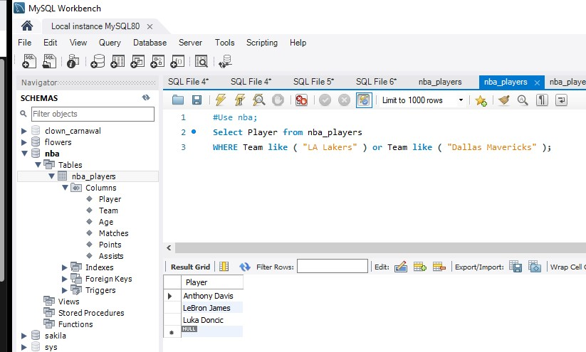

### MySQL
Здесь можно посмотреть простые команды для БД , Workbench
- __У нас есть таблица nba_playerse:__

Player | Team | Age | Matches | Points | Assists |
:------|:----:|:---:|:-------:|:------:|:-------:|
LeBron James | LA Lakers|37| 41| 1192| 187|
Demar Derozan| Chicago Bulls| 32| 55| 1547| 164|
Stephen Curry| GS Warriors| 33|	54|	1393| 164|
Trae Young|	Atlanta Hawks| 23| 53| 1475| 494|
Luka Doncic| Dallas Mavericks| 22|	44|	1212| 395
Anthony Davis| LA Lakers| 28| 37| 855| 102|
Zach LaVine| Chicago Bulls|	26|	47|	1156| 360


  1. Вывести всех игроков из команд LA Lakers и Dallas Mavvericks
```
Use nba;
Select Player from nba_players 
WHERE Team like ( "LA Lakers" ) or Team like ( "Dallas Mavericks" );
 ```


  2.  Вывести всех игроков, заработавших больше 1200 очков
 ```
 Use nba;
Select Player from nba_players WHERE Points > 1200;
 ```


3. Вывод всех команд, в названии которых содержится больше 2-х букв "A"
```
Use nba;
Select Team from nba_players WHERE (Team like "%A%A%");
```


4. Вывести список игроков не старше 30 лет, у которых количество передач больше 370
```
Select Player from nba_players WHERE ( Age <= 30) AND ( Assists >370 );
```
